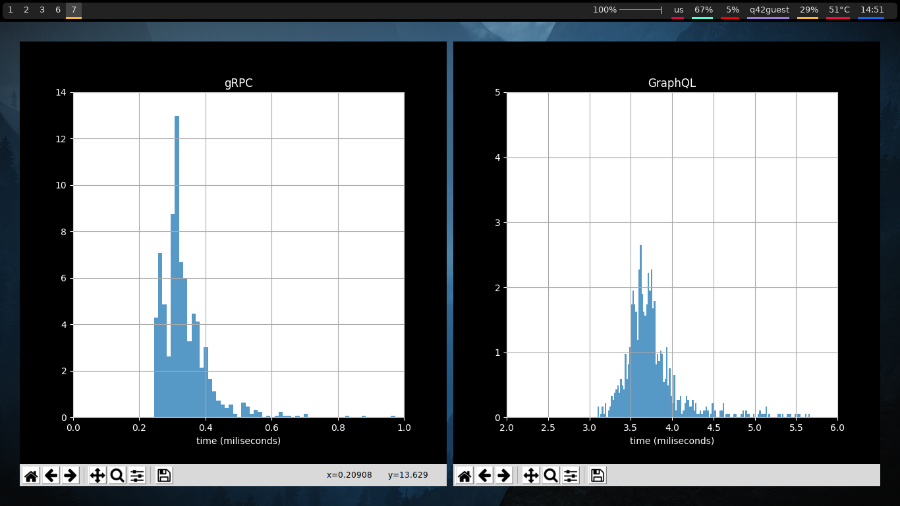

# Description

Comparing round trip speed between GraphQL and gRPC using javascript.


# Installation
## GraphQL server

```cd GraphQL```
```npm install```
```npm start```

## gRPC server

```cd gRPC```
```npm install```
```npm start```

## Install python dependecies

```pip install requests matplotlib argparse numpy```

# Usage

At this point you should have a GraphQL server running at port 4000 and a gRPC server running at port 50051. To now test performance execute the python files for plotting.


## For gRPC

```cd gRPC```

make requests by typing:
```node client.js```

your times should be saved at results.txt

to now plot this data type:
```python3 plotfile.py```


## For GraphQL

```cd GraphQL```

execute the python script:
```python3 plot.py```

**You can add --times [amount] for more samples**

# Results

Yes gRPC is actually a lot faster. I would still rather work with GraphQL since gRPC is a pain in the ass.

