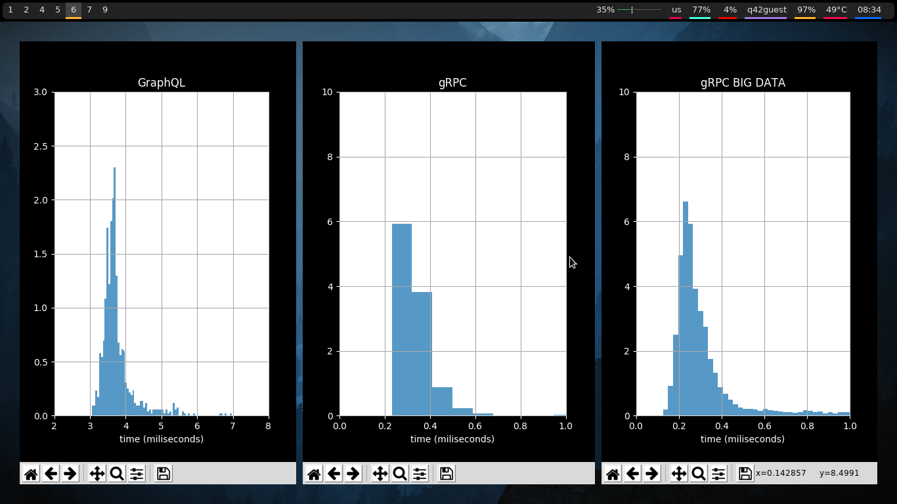
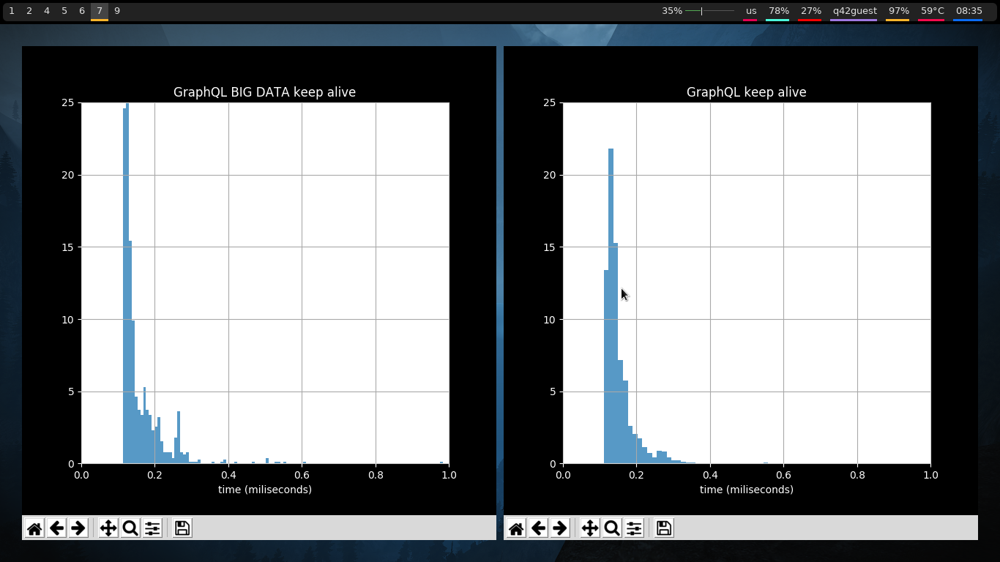
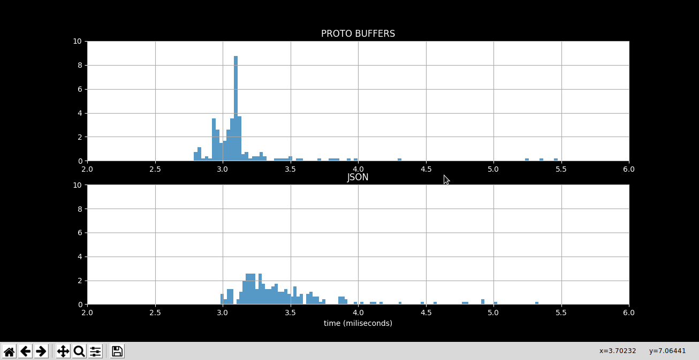

# Description

Comparing round trip speed between GraphQL vs gRPC and JSON vs Protocol Buffers.

See folders for further instructions.

to quickly test for yourself do:
```
# give executable permission
chmod +x GraphQLvsgRPC/GraphQL/GraphQLlauch.sh GraphQLvsgRPC/gRPC/gRPClauch.sh
# lauch the scripts (first time add -s install)
./GraphQLvsgRPC/GraphQL/GraphQLlauch.sh
./GraphQLvsgRPC/gRPC/gRPClauch.sh
# give the parameters it asks for
```






